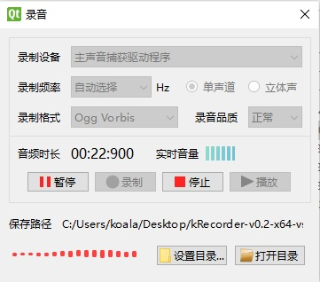

# kRecorder

#### 介绍
基于Qt的简易录音程序。

#### 依赖库
RtAudio: 录音和回放

libsndfile: 音频文件编码

smarc: 频率重采样

cmdline: 命令行参数支持

#### 编译
使用vs2019编译。由于Qt使用MD标记编译，所以本程序和使用的库也统一使用MD标记编译。

RtAudio在静态库编译情况下，会自动将MD标记改写为MT标记，可通过手动设定RTAUDIO_STATIC_MSVCRT为false避免。

RtAudio建议使用RTAUDIO_API_DS模式编译，RTAUDIO_API_WASAPI模式有bug，交叉打开关闭input、output设备会出现异常（不能正常录音）。

#### 使用
程序运行界面如下：

另外，可通过命令行参数--hide实现隐藏运行。具体参数选项如下：

    --hide， 隐藏运行并自动录音
    --stereo,  启动立体声录音，默认为单声道
    --format,  指定录音格式，当前支持ogg, opus, flac, wav，默认为ogg
    --quality, 指定录音品质，可选0-4，数字越高品质越高，默认为2，表示正常品质
    --rate, 指定录音设备频率，可选8000-96000,，默认为0，表示根据录音品质自动选择采样频率
    --path, 指定录音文件保存目录，缺省为程序所在目录

比如在命令行输入以下指令

    kRecorder.exe --hide --format=opus --quality=1 --path="d:/录音"

将隐藏启动kRecorder，并自动启动一般品质录音（quality=1），录音文件保存到"d:/录音"目录，文件编码格式为opus。
